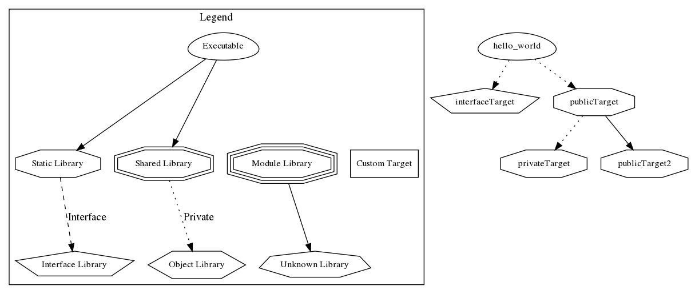

# Sandbox

This project is a sandbox for exercising C/C++ and CMake topics.

## Building

```bash
mkdir build
cmake -S . -B build -G Ninja -DCMAKE_BUILD_TYPE=Debug
cmake --build build
```

## Running

```bash
./build/hello_world
```

## Dependency Graph

```bash
cmake -S . -B dot -G Ninja  --graphviz=dependency.dot
dot -Tpng dependency.dot -o dependency.png
```

## CMake Access Rights

CMake has a great feature of controlling targets access rights. The target can
be linked as PUBLIC, PRIVATE or INTERFACE. This repository is meant to
demonstrate this feature.

### Public vs. Private

Firstly, to understand the project's dependency structure one need have a look
at the graph below:



Thanks to the `cmake`, the `hello world` target can access entities in the
`publicTarget2` but not `privateTarget`. To test this one can uncomment related
lines in the main.cpp.

Please note that the same access rights apply to the include directories thus
one can control which header files are public and which are private within the
target.

### Interface Target

The INTERFACE target is a special case where the target is not actually build
but rather forward to the target that uses this interface and linked there.

This can be easily verified by looking at the Ninja Script i.e. the
`interfaceTarget.cpp` is build during the `hello_world` target's build, and
there is no `interfaceTarget.a` library being linked, where both `publicTarget`
and `publicTarget2` are linked separately.
